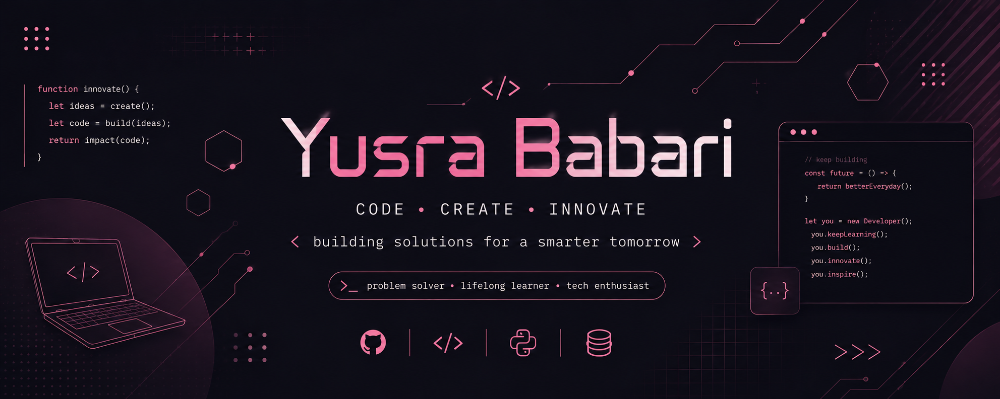

<!-- Banner -->

  

<!-- Nav pills -->

## 💜 About Me

<table align="center" width="100%">
<tr>
<td style="background:#1a0b2e; border-radius:12px;" width="60%">

Hey there! I'm **Yusra Babari**, a Computer Science student based in the UK 🇬🇧.
I love exploring **AI, machine learning, and web development**, and I'm currently
sharpening my skills in Python, SQL, and building small projects that turn ideas
into working code.

- 🎓 Studying Computer Science
- 🧠 Focus: AI • Web Development • Problem Solving
- 📚 Currently learning: Python • Machine Learning • SQL
- 🛠️ Status: Building cute & powerful projects every day
- ⚡ Fun fact: I learn best by breaking things (and fixing them)

</td>
</tr>
</table>

## 🧩 Technologies

  

## 📊 Statistics

  
  

  

## 📈 Contribution Graph

  

## 📌 Pinned Ideas / Currently Learning

| Area | Stack |
|---|---|
| 🤖 AI / ML | NumPy • Pandas • Scikit-learn • Jupyter |
| ⚙️ Core | Python • SQL |
| 🔧 Workflow | VS Code • Git & GitHub |

